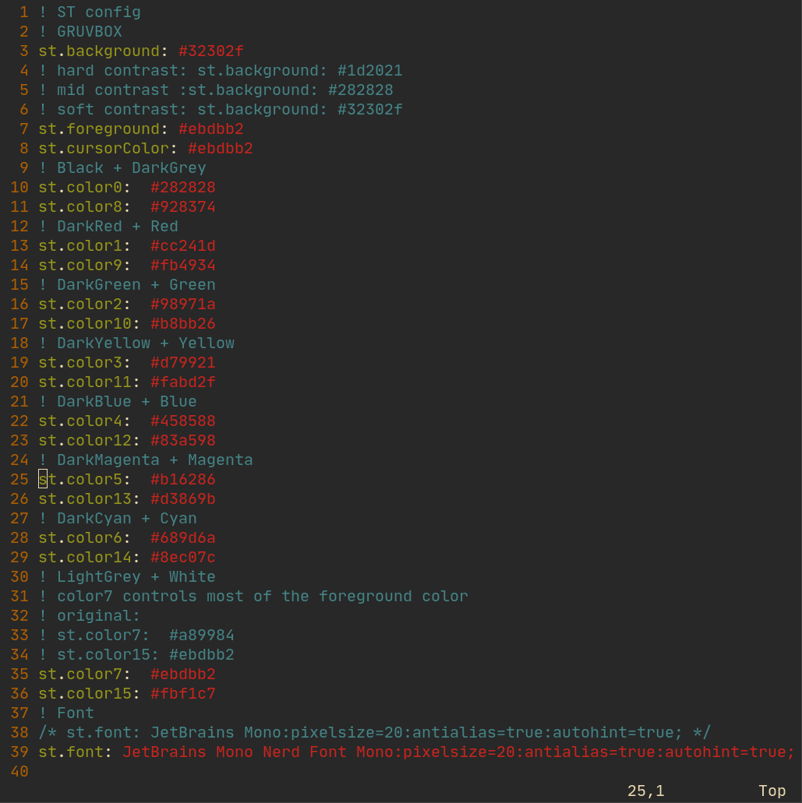
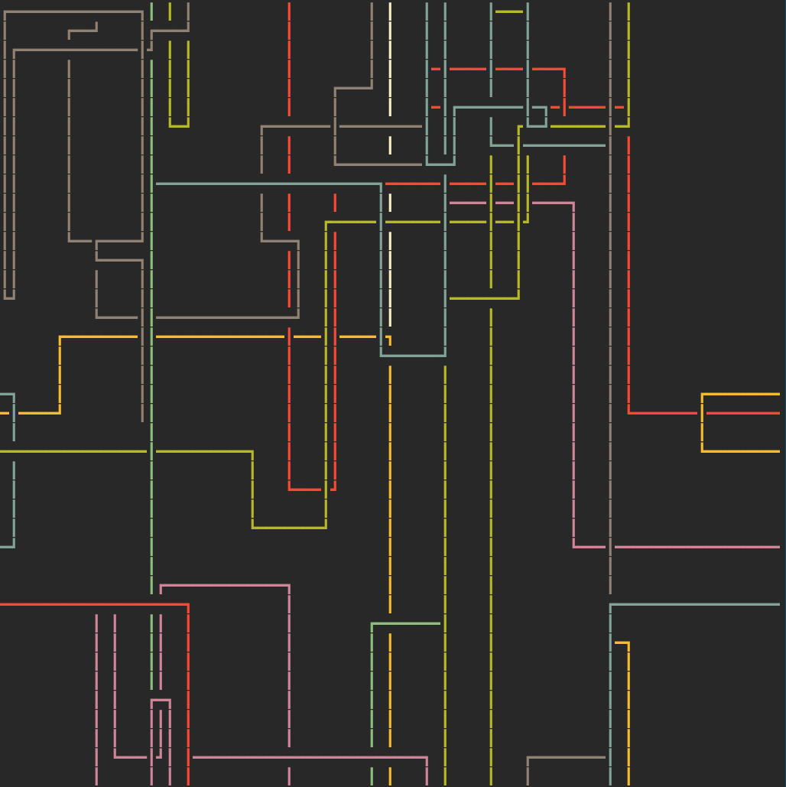

# My build of st

Original website : [https://st.suckless.org/](https://st.suckless.org/).

## Installed patches

- [st-meta-vim-full-20200618-43a395a.diff](patches/st-meta-vim-full-20200618-43a395a.diff)

Adds the ability to move around the output of the terminal using _vim_ commands, pretty sweet.
This patch is compiled directly from the source : [https://github.com/juliusHuelsmann/st-history-vim](https://github.com/juliusHuelsmann/st-history-vim).

- [st-scrollback-20200618-historyVanilla.diff](patches/st-scrollback-20200618-historyVanilla.diff)

Adds the ability to just jump in the history without going into _vim_-mode. Useful to scrollback using the mouse.

- [st-xresources-20190105-3be4cf1.diff](patches/st-xresources-20190105-3be4cf1.diff)

Reads the `.Xdefaults` file to get the _colors_ + _font_ (current theme : Gruvbox + JetBrains Mono Nerd Font).

## Screenshots

